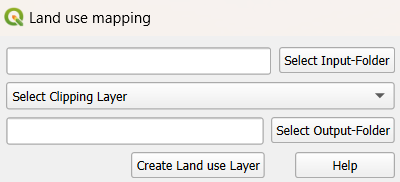

================
Land use mapping
================

   This plugin feature offers the functionality to map land use data to Talsim land use categories. Currently, only the mapping of ATKIS land use data is implemented. 

Executing the Plugin
^^^^^^^^^^^^^^^^^^^^
   The user must provide a folder containing all relevant ATKIS layers (e.g., veg01_f, sie01_f, etc.). The plugin automatically detects the necessary files and merges them into a single land use layer. Optionally, the user can specify a clipping layer to limit the extent of the merged result.

   Once merged (and optionally clipped), the plugin maps ATKIS land use types to Talsim-compatible categories using the fields "OBJART_TXT", "FKT", and "VEG".

   The output is a GeoPackage containing two land use layers:

   - One layer with all land use polygons, where the mapped Talsim land use type is stored in the column "OBJART_NEU".
   - A second, dissolved layer where polygons with the same land use type are aggregated. This layer can be used as input for the HRU Calculation.

   |Screenshot Land use mapping|

