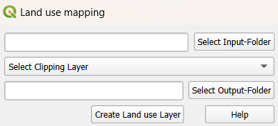
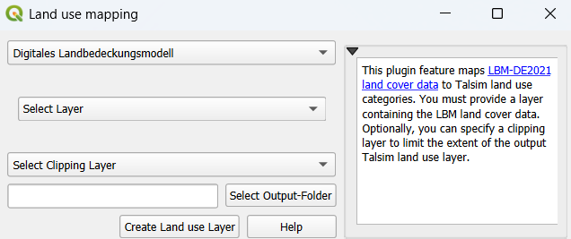

================
Land use mapping
================

   This plugin feature offers the functionality to map land use datasets to Talsim land use categories. This plugin currently supports two German data sources:

   * **ATKIS** - Automatisiertes Topographisch-Kartographisches Informationssystem (e.g. `ATKIS NRW <https://www.bezreg-koeln.nrw.de/geobasis-nrw/produkte-und-dienste/landschaftsmodelle/aktuelle-landschaftsmodelle/digitales-basis>`_)
   * **LBM-DE (2021)** - `Digitales Landbedeckungsmodell für Deutschland, Stand 2021 <http://bit.ly/46K4sfd>`_
   * **ESA World Cover** - `ESA World Cover 10m 2021 <https://esa-worldcover.org/en/data-access>`_

Executing the Plugin
^^^^^^^^^^^^^^^^^^^^

ATKIS Data
----------

   **Input Requirements:**

   Provide a folder containing all relevant ATKIS layers (e.g., ``veg01_f``, ``sie01_f``, etc.)

   **Processing:**

   - Plugin automatically detects and merges necessary files into a single land use layer
   - Optional: Specify a clipping layer to limit the spatial extent
   - Maps the ATKIS land use types to Talsim-compatible categories using the fields "OBJART_TXT", "FKT", and "VEG". Find the complete `ATKIS to Talsim mapping table here <https://github.com/sydroconsult/QTalsim/blob/main/QTalsim/talsim_parameter/atkis_talsim_zuordnung.csv>`_.
   
   |Screenshot Land use mapping ATKIS|

LBM-DE (2021) Data  
------------------

   **Input Requirements:**

   Download data from the link above and add the layer to your current QGIS project

   **Processing:**

   - Specify the layer containing LBM data
   - Optional: Apply a clipping layer to limit the input extent
   - Mapping uses fields "LB_AKT" (land cover type) and "SIE_AKT" (imperviousness). Find the complete `LBM to Talsim mapping table here <https://github.com/sydroconsult/QTalsim/blob/main/QTalsim/talsim_parameter/lbm_talsim_zuordnung.csv>`_.

   |Screenshot Land use mapping LBM| 

ESA World Cover Data
----------------------

   **Input Requirements:**
   You can use the ESA WorldCover dataset in one of the following ways:
   - Download the data using the QGIS plugin by specifying a layer that defines the area of interest (AOI), or
   - Download the ESA WorldCover dataset manually from the link above and add the raster layer to your current QGIS project.

   **Processing:**

   #. Choose whether to: 

      - download the ESA WorldCover data using the QGIS plugin, or 
      - use an existing ESA WorldCover layer from the current QGIS project. 
      
   #. If downloading the data, specify the layer defining the area of interest. If using an existing dataset, select the corresponding ESA WorldCover layer. 
   #. *(Optional)* Enable **Resampling** and specify the target spatial resolution (in meters) to reduce the raster resolution. 
   #. Apply a clipping layer to restrict the dataset to the desired extent. 
   #. The land cover mapping is based on the ``class`` attribute, which stores the ESA WorldCover land cover class codes.
   
   |Screenshot Land use mapping ESA|

Output Results
==============

   The output is a GeoPackage containing two land use layers:

   - One layer with all land use polygons, where the mapped Talsim land use type is stored in the column "OBJART_NEU".
   - A second, dissolved layer where polygons with the same land use type are aggregated. This layer can be used as input for the HRU Calculation.

.. |Screenshot Land use mapping ESA| image:: qtalsim_screenshots/landuseMappingFeatureESA.png