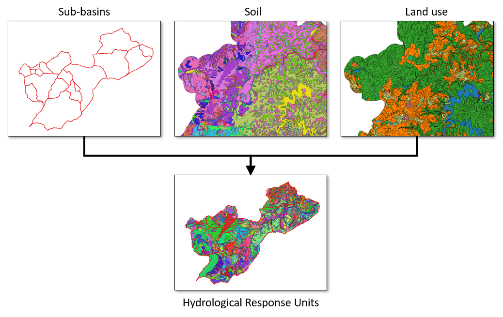

===============
HRU calculation
===============

   HRU calculation is one core functionality of the QGIS plugin QTalsim,
   designed to create hydrological response units (HRUs) suitable for Talsim. 
   The plugin processes three layer, including a sub-basin layer, soil layer 
   and land use layer. It clips the layers in accordance with the sub-basin layer’s boundaries. The plugin then intersects those three layers and creates HRUs.
   Additionally, the plugin offers functionality to remove duplicate geometries, overlapping features and unwanted gaps.

   |Overview QTalsim|
   **Input:**

   -  Sub-basin layer
   -  Soil layer
   -  Land use layer
   -  CSV-file containing talsim land use types and parameters

   **Output:**

   -  Geopackage containing HRU, land use, soil texture and soil type
      layers
   -  Layers are also added to the current QGIS project
   
.. toctree::
   :maxdepth: 2

   hrus_getting_started
   hrus_step_by_step

