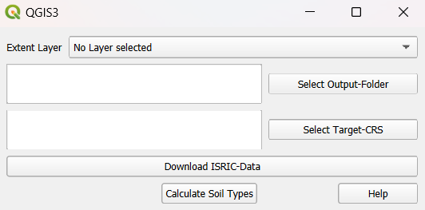
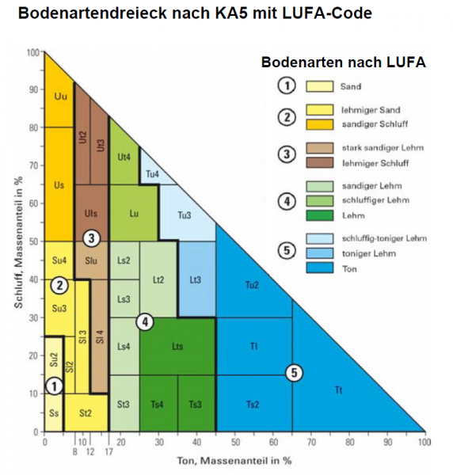

=========================
ISRIC Soil Type Converter
=========================
   Another core functionality of QTalsim is downloading and processing soil data from `ISRIC <https://www.isric.org/>`__. The plugin downloads the data based on a bounding box defined by the user and then creates an output layer containing the soil type and bulk density class for all cells in the input area across six soil layers.

   |Screenshot Soil preprocessing|

Executing the Plugin
^^^^^^^^^^^^^^^^^^^^

   To execute this plugin, the user must select the following:

- An input layer that defines the bounding box.
- An output folder where the plugin will save all generated files. 
- A target CRS to which the output layers will be transformed.

   When the "Download ISRIC Data" button is clicked, the plugin downloads data for clay, silt and sand share, and bulk density within the area defined by the bounding box. The raster files are saved in the specified output folder. The original output files, as returned by ISRIC (in the Homolosine projection), are stored in the 'orig' folder, while the reprojected files (in the user-defined projection) are stored in the 'proj' folder. Each of these folders will contain four files for each of the six soil layers.

   Next, the user can select "Calculate Soil Type." In the first step, the plugin recalculates the values from the mapped units to conventional units, as defined `here <https://www.isric.org/explore/soilgrids/faq-soilgrids#What_do_the_filename_codes_mean>`__. Then, the soil type for each cell is calculated using the clay, silt, and sand proportions, following the soil texture triangle below. The results are saved to the output folder and added to the current QGIS project. In the layer "Soil Types Combined" the soil types of the soil layers are displayed in the different columns of the layer. Additionally, the bulk density values are recalculated and are assigned to the respective bulk density class. The soil types and bulk density class values are intersected and merged into one layer. This vector layer holds the BDOD class and soil type name for every cell. This layer "Soil Types BDOD Combined" can be used as soil layer input to "QTalsim HRU calculation". 

.. |Bodenartendreieck| 

   Source: `Geologischer Dienst NRW 2012 <https://www.gd.nrw.de/zip/bo_Bestimmungsschluessel-Bodenart.pdf>`__ 

