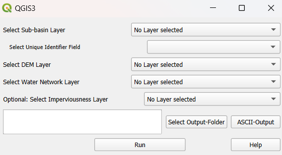

========================
Sub-basins preprocessing
========================
   The third core functionality allows you to calculate the longest flowpath for each sub-basin in the input layer. Please note that to use this functionality, SAGA GIS and WhiteboxTools must be installed.
   
Input:
^^^^^^
   - Sub-basin layer
   - Digital Elevation Model (DEM) layer
   - Water network layer

Prerequisites
-------------
   .. prerequisites:
   
   To use this plugin's functionality, SAGA GIS and WhiteboxTools must be installed.
   - SAGA GIS: Ensure that the "Processing Saga NextGen Provider" plugin is installed via the Plugin Manager in QGIS.
   - WhiteboxTools: Install the "WhiteboxTools for QGIS" plugin, and make sure the environment path is set correctly. For further guidance, you can watch this instructional `video <https://www.youtube.com/watch?v=xJXDBsNbcTg>`__ produced by Whitebox.

Executing the plugin
--------------------
   
   After installing SAGA GIS and WhiteboxTools, you can run the plugin. Follow these steps:

Select Layers:
^^^^^^^^^^^^^^
   - Choose the correct polygon layer for the sub-basin layer.
   - Select the field that contains the unique identifier for the sub-basins.
   - Select the DEM layer (raster layer) and the water network layer (line layer).
   
Output Folder:
^^^^^^^^^^^^^^
   - When choosing the output folder, it is recommended to use a folder that does not contain any spatial files.

   The plugin first burns the water network into the DEM using the QGIS "Raster calculator".
   It then applies SAGA's "Fill sinks (Wang & Liu)" tool to fill any sinks in the DEM. After this The plugin uses WhiteboxTools' "LongestFlowPath" (LFP) to generate the longest flowpath for each sub-basin. To address an issue with LFP creating disconnected flowpaths across different sub-basins (see details `here <https://github.com/jblindsay/whitebox-tools/issues/289>`__), the plugin processes each sub-basin individually, generating the LFP for each one separately. Finally, the plugin saves the correct LFP for each sub-basin and merges them into a single layer.
   
   The final LFP layer is added to the current QGIS project and saved to the specified output folder. Additionally, the burned and filled DEM layer is also saved and added to the current project.

   |Screenshot Sub-basin preprocessing|

