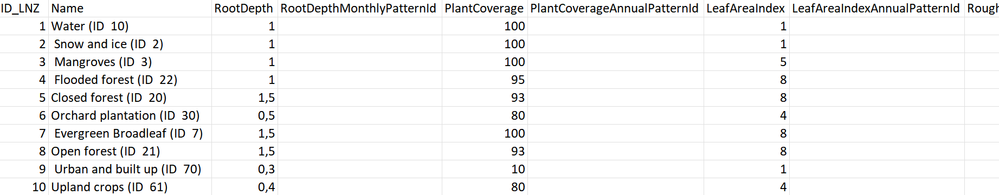

Getting Started with HRUs
-------------------------
.. _getting-started:

Requirements for Input Layers
^^^^^^^^^^^^^^^^^^^^^^^^^^^^^
   .. _requirements-for-input-layers:

   All three input layers must be polygon layers and included in the
   current QGIS project.

   #. Sub-basin layer

      This layer should contain the sub-basins as well as a field for
      Unique Identifiers and another one for slope.

   #. Soil Layer

      This layer should contain all soil types within the study area,
      but it must only consist of one soil layer. It must contain a
      field specifying the names of the soil types.

   #. Land Use Layer

      This layer should contain all land use areas within the study
      area, and it must contain a field specifying the names of the land
      use types. 

      3.1 CSV-File with Talsim land use types + parameters

         In addition to the land use layer, a CSV-File containing the
         necessary Talsim land use types and their associated parameters
         is also required. The screenshot below shows one example of
         what the first lines of the CSV-file could look like:

         |Screenshot CSV-File|

         The following fields should be included in the CSV-file, the
         bold fields must be included:

         **Id**, **Name**, RootDepth, RootDepthMonthlyPatternId,
         PlantCoverage, PlantCoverageAnnualPatternId, LeafAreaIndex,
         LeafAreaIndexAnnualPatternId, RoughnessCoefficient,
         KcCoeffAnnualPatternId, KyYieldAnnualPatternId,
         BulkDensityChange, pTAW

         However, the plugin does not require every field to contain
         values.

      

