Step by Step
------------
.. _step-by-step:

Select Sub-basin Layer
^^^^^^^^^^^^^^^^^^^^^^
.. _select-sub-basin-layer:

      First, select the layer containing the sub-basins from the
      drop-down-menu that lists all polygon layers in your current QGIS
      project. After selecting the layer, the sub-basin layer's field containing the
      unique identifier must be selected from
      the drop-down menu. Confirm your selection by clicking on the ‘Confirm
      Sub-basins’-Button. Upon clicking this button the Sub-basin layer
      is selected, and overlapping features and duplicates are removed.
      You can inspect the result in your QGIS project (layer
      'Sub-basins').

      |Select Sub-basin|

Elimination of Hydrologic Response Units (HRUs)/small polygons
^^^^^^^^^^^^^^^^^^^^^^
.. _elimination_hrus_polygons:
      Specifying values in this section has two different effects.

      This part of the plugin was implemented to eliminate small polygons. Soil polygons and/or land use areas that fall below the specified size or percentage are eliminated. 
      The percentage of all features with the same parameters is calculated by comparing the size of the polygons to its sub-basin's area. These polygons are eliminated when confirming the soil/land use mapping, using the chosen elimination mode.

      Secondly, HRUs are eliminated according to the specified parameters (sub-basin, soil and land use) during the intersection process. HRUs that fall below the specified size or percentage share are deleted and filled using the 'Eliminate' tool. 
      You can select the elimination mode from the drop-down menu (find further information
      `here <https://docs.qgis.org/3.28/en/docs/user_manual/processing_algs/qgis/vectorgeometry.html?highlight=eliminate#eliminate-selected-polygons>`__).
      
      Tip: You can apply different minimum sizes for soil/land use features and HRUs by adjusting the values before the desired step. For example, you can change the values before mapping the land use features or before the intersection process. 

      |Eliminate Polygons|

Select & Edit Soil Layer
^^^^^^^^^^^^^^^^^^^^^^^^

.. _select-and-edit-soil-layer:

      -  **Select Soil Layer**

         Choose the soil layer from the drop-down menu and confirm your
         selection by clicking ‘Confirm Soil’. Upon doing so, all valid
         geometries of this layer are selected and clipped to match the
         boundaries of the Sub-basin layer. During this step duplicate
         geometries are removed from the layer and the soil mapping
         table is populated with the fields of the soil layer.

      -  **Soil Mapping**

         This table contains Talsim soil parameters in the first column
         and all the field names of the soil layer in drop-down menus in
         the other six columns. These six columns represent the soil layers. In this step, users are required to map each
         Talsim parameter to its corresponding fields in the soil layer.
         The table below shows the necessary type for these parameters. Additionally, it also shows the required unit and restrictions of the parameters. If the user-mapped field has a different datatype, the plugin,
         where possible, converts the field’s values to the parameter’s
         type. If ‘Parameter not available’ is selected, that parameter
         will be added with null values.

         To finalize the soil mapping, click ‘Confirm Soil Mapping’. If the user
	 defines area/percentage thresholds, soil features below these thresholds are
	 deleted during this step. The user can set a minimum size of
         the soil features [m²] and a minimum percentage of the soil features relative to the
         sub-basin's area. Soil features that fall below the specified size or
         percentage share are deleted and filled using the
         ‘Eliminate’-tool.
         This creates a new layer, containing all fields from the soil
         layer and all parameters from the soil mapping table, assigned
         with values from their corresponding fields. If there is a
         datatype mismatch between the soil layer’s field and the
         parameter, a warning is logged.

         ==============================     ===========     ===========     ===========================
         Parameter                          Unit            Type            Restriction
         ==============================     ===========     ===========     ===========================
         ID_Soil                                              int              
         NameSoil                                             string          max length 4
         Description                                          string           
         BulkDensityClass                                     int             1 >= x >= 5
         Category                                             int             1 = Sand, 2 = Silt, 3 = Clay
         WiltingPoint                         mm/m            float           0 >= x >= 1000
         FieldCapacity                        mm/m            float           0 >= x >= 1000
         TotalPoreVolume                      mm/m            float           0 >= x >= 1000
         KfValue                              mm/h            float           0 > x
         MaxInfiltration                      mm/h            float           0 > x
         MaxCapillarySuction                  mm/h            float           0 >= x
         LayerThickness1                      m               float           0 > x
         ==============================     ===========     ===========     ===========================

         |Select and Edit Soil Layer|

      -  **Optional Soil Editing Steps**

         Before finalizing the soil layer, users have the option to
         perform some editing steps. Please refer to section `Optional
         Editing Steps <#optional-editing-steps>`__ below for a detailed
         explanation of ‘Check for Overlapping Features’, ‘Delete
         Overlapping Features’, ‘Check for Gaps’ and ‘Fill Gaps’.

         In addition to the option of deleting all overlapping parts
         (using button 'Delete All Overlapping Features'), you can also
         selectively remove specific overlapping soil features. This can
         be done via the table that populates when you click 'Check for
         Overlapping Features'. This table displays all overlapping soil
         features across two columns. For each pair of overlapping
         features, you can decide, which feature's geometry should stay
         unchanged, and which should have its overlapping part removed
         from its geometry. In the third column, you can select features
         to highlight them in the soil layer, allowing for easy viewing.
         After you have identified all the unwanted overlapping parts,
         simply press 'Delete overlapping part of selected Features' to
         remove the overlapping parts from the selected features.

         |Optional Soil Layer Steps|

      -  **Create Soil Layer**

         This step dissolves the layer according to the Talsim
         parameters, removes the fields that are not required for Talsim
         and creates the soil layer used for the intersection.

Select and Edit Land use layer
^^^^^^^^^^^^^^^^^^^^^^^^^^^^^^

.. _select-and-edit-landuse-layer:

      -  **Select Land use Layer**

         First, select the land use layer from the drop-down menu and
         confirm your selection by clicking ‘Confirm Layer’. Upon doing
         so, all valid geometries of this layer are selected and clipped
         to align with the boundaries of the sub-basin layer. During
         this process, any duplicate geometries within the layer are
         also removed. 

         |Select Land use Layer|

      -  **Land use Mapping**

         The land use mapping table is populated similarily to the soil mapping table. The first column contains Talsim land use parameters and the second column contains drop-down menus with all field names of the input land use layer.  Here, you must match each Talsim parameter (in the first column) with the corresponding field in the input layer (in the second column).
         
		 The table below shows the necessary types for these parameters. Additionally, it also shows the required unit and restrictions of the parameters. If the user-mapped field has a different datatype, the plugin,
         where possible, converts the field’s values to the parameter’s type. 
		 
		 If ‘Parameter not available’ is selected, the plugin is trying to fill those parameters with Talsim parameters using the "Name"-field. The list with land use names and their parameters can be found here: :download:`Land use parameters file <_static/landuseParameterValues.csv>`. If the land use name is not found, that parameter will be added with null values. Only for pTAW 0,5 is used as default value, if the user does not insert a parameter. 
		
         After completing the mapping, click ‘Confirm Landuse Mapping’ to create a new
         layer containing the input fields from your layer and the
         Talsim parameter values. If the user defines area/percentage thresholds, land use features below these thresholds are
	 deleted during this step. The user can set a minimum size of
         the land use features [m²] and a minimum percentage of the land use features relative to the
         corresponding sub-basin's area. Land use features that fall below the specified size or
         percentage share are deleted and filled using the ‘Eliminate’-tool.

         ==============================     ======     =====     =====================
         Parameter                          Type       Unit      Restrictions
         ==============================     ======     =====     =====================
         ID_LNZ                             int                    
         Name                               string                 
         RootDepth                          float      m          0 >= x
         RootDepthAnnualPatternId           int                    
         PlantCoverage                      float      %          0 >= x >= 100
         PlantCoverageAnnualPatternId       int                    
         LeafAreaIndex                      float                 0 >= x
         LeafAreaIndexAnnualPatternId       int                    
         RoughnessCoefficient               float      m⅓/s       0 >= x
         KcCoeffAnnualPatternId             int                    
         KyYieldAnnualPatternId             int                    
         BulkDensityChange                  int                    
         pTAW                               float                 0 >= x >= 1
         ==============================     ======     =====     =====================

         |Land use Mapping|

      -  **Optional Editing Steps for Land use Layer**
		
         After confirming the land use mapping you have the option to
         perform additional editing steps, such as deleting overlapping
         features and filling gaps. For more detailed information on
         these steps, please refer to section `Optional Editing
         Steps <#optional-editing-steps>`__.

         In addition to the option of deleting all overlapping parts
         (using button 'Delete All Overlapping Features'), you can also
         selectively remove specific overlapping landuse features. This
         can be done via the table that populates when you click 'Check
         for Overlapping Features'. This table displays all overlapping
         landuse features across two columns. For each pair of
         overlapping features, you can decide, which feature's geometry
         should stay unchanged, and which should have its overlapping
         part removed from its geometry. In the third column, you can
         select features to highlight them in the landuse layer,
         allowing for easy viewing. After you have identified all the
         unwanted overlapping parts, simply press 'Delete overlapping
         part of selected Features' to remove the overlapping parts from
         the selected features.

         |Optional Steps Land Use Layer|

      -  **Create Land use Layer**

         Clicking ‘Create Land Use Layer’ dissolves the layer according
         to the Talsim parameters, removes any fields that are not
         required for Talsim and generates the land use layer that will
         be used for intersection.

         |Create Land use Layer|

Intersection of Layers
^^^^^^^^^^^^^^^^^^^^^^

.. _intersection-layers:

      This step results in the creation of the files: BOD, BOA, LNZ and
      EFL, which can be used as input files for Talsim. To calculate the slope for each HRU, the user must input a Digital Elevation Model (DEM).
      This model is used to calculate the mean slope for each of the created HRUs. 
      To generate the HRUs, the three layers (sub-basins, soil and land use) are
      intersected in a first step. The user can set a minimum size of
      the HRUs [m²] and a minimum percentage of HRUs relative to the
      sub-basin's area (see above). The sum of the areas of all HRUs with the same parameters is
      compared with the area of the corresponding sub-basin. HRUs that fall below the specified size or
      percentage share are deleted and filled using the
      ‘Eliminate’-tool. You can select the elimination-mode from the
      drop-down menu (find further information
      `here <https://docs.qgis.org/3.28/en/docs/user_manual/processing_algs/qgis/vectorgeometry.html?highlight=eliminate#eliminate-selected-polygons>`__).

      Gaps within the sub-basin layer are left unfilled, while all other
      gaps are appropriately filled. Any overlapping features within the
      resulted intersected layer are removed.

      |Intersect Layers|

      The resulting layers are then automatically added to the current
      QGIS project.

Save Layers
^^^^^^^^^^^

.. _save-layers-to-geopackage:

   
   In the final step, users can choose to export the processed layers in either ASCII format (for Talsim NG4), SQLite format (for Talsim NG5), or both.

   - ASCII-Export
     
     To export in ASCII format, users need to specify only the ASCII file name. The plugin will generate all relevant files with the appropriate extensions (.EFL, .BOD, .BOA, .LNZ, .JGG), ensuring compatibility with Talsim 4.

   - SQLite Export
    
     For SQLite export, users must select an existing Talsim database (e.g., one created using QTalsim – Sub-basins preprocessing) and specify the scenario to which the data should be assigned. Tables HydrologicalReponseUnit, SoilType, SoilTexture, LandUse, Pattern and PatternNumberValue of the specified scenario will be filled. This export is compatible with Talsim 5.

   After configuring the desired export options, users must click ‘Select Output Folder’ to choose the directory where all outputs will be saved. This includes both the ASCII files and the GeoPackage export.

   Finally, clicking ‘Save’ will:

   - Export the layers in the selected format(s)
   - Store the resulting data in a GeoPackage under a user-defined name
   
   |Final Steps|

Optional Editing Steps
^^^^^^^^^^^^^^^^^^^^^^
.. _optional-editing-steps:

   For both the soil layer and the land use layer, the user has the
   option to perform additional editing steps.

   -  **Check for Overlapping Features**

      This function checks for overlapping features within the layer. It
      identifies features that are either partially or completely
      overlapping. The overlapping part must be greater than 10 m²; otherwise, it is ignored. Therefore, overlapping parts 
      below 10 m² are not indicated in the table and are not removed by the plugin.
      The feature IDs of the overlapping features are logged in the
      QTalsim-Log and are also indicated in a table below this button. Additionally, a layer named ‘Layer with
      overlapping features’ is added to the QGIS project. You can then
      inspect the overlapping features by reviewing this layer’s
      attribute table by searching for the overlapping feature IDs or by selecting the features in the table (see "Delete Overlapping Part of selected Features").

      |Check for overlapping Features|

   -  **Delete All Overlapping Features**

      This function removes all overlapping parts of a layer. The overlapping part must be greater than 10 m²; 
      otherwise, it is ignored. Therefore, overlapping parts below 10 m² are not removed by the plugin. If two
      polygons overlap, the overlapping part is assigned to the smaller
      of the two polygons.
  
   -  **Delete Overlapping Part of selected Features**

      In addition to the option of deleting all overlapping parts
      (using button 'Delete All Overlapping Features'), you can also
      selectively remove specific overlapping soil/land use features. This can
      be done via the table that populates when you click 'Check for
      Overlapping Features'. This table displays all overlapping soil/land use
      features across two columns. Remember, it only shows overlapping parts that are greater than 10 m². For each pair of overlapping
      features, you can decide, which feature's geometry should stay
      unchanged, and which should have its overlapping part removed
      from its geometry. In the third column, you can select features
      to highlight them in the soil layer, allowing for easy viewing.
      After you have identified all the unwanted overlapping parts,
      simply press 'Delete overlapping part of selected Features' to
      remove the overlapping parts from the selected features.
	
   -  **Check for Gaps**

      This function checks for gaps in the soil/land use layer. It
      identifies not only gaps within the layer itself but also gaps
      that occur along the boundary of the sub-basin layer. A separate
      layer, which includes all detected gaps from the soil or land use
      layer, is then added to the QGIS project. This allows the user to
      inspect and analyze these gaps more closely.

   -  **Fill Gaps**

      This function fills all detected gaps in the layer using the
      Eliminate-tool. You can specify the elimination-mode from a
      drop-down menu (find further information
      `here <https://docs.qgis.org/3.28/en/docs/user_manual/processing_algs/qgis/vectorgeometry.html?highlight=eliminate#eliminate-selected-polygons>`__).
      The result of this step is a layer free of gaps and matching the
      extent of the sub-basin layer.
   
   In general, it is recommended to delete the overlaps before and after filling gaps.
   Particularly complex geometric structures may result in new overlaps or gaps.
   The plugin in some cases may struggle to automatically fill very small gaps or
   delete very small overlaps, particularly for complex geometries. 
   If overlaps & gaps persist after several attempts to delete overlaps and fill gaps, manual deletion is recommended (if necessary).

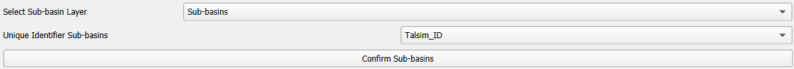
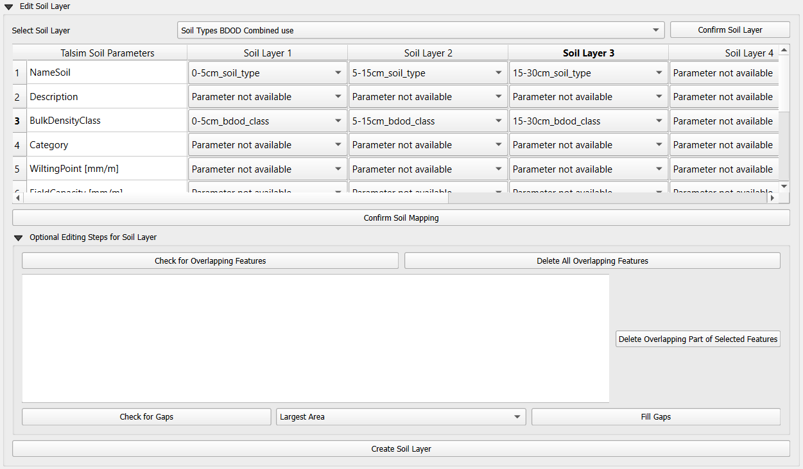
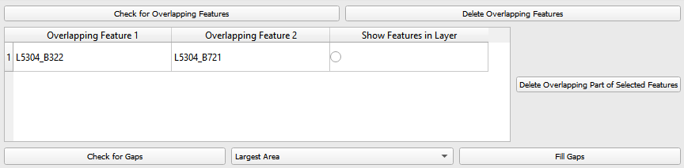
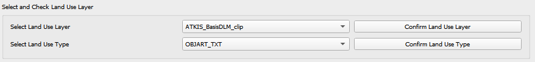
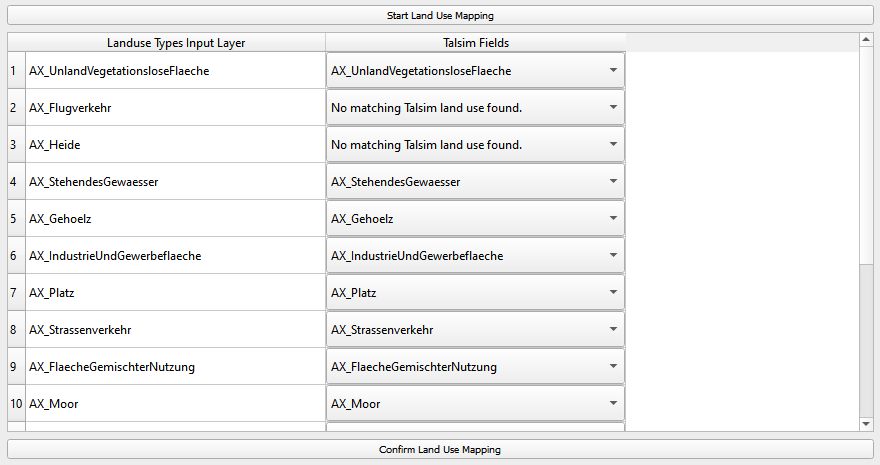
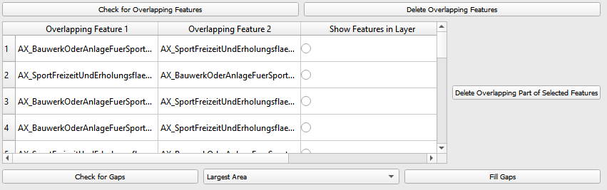
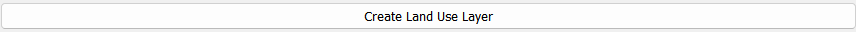
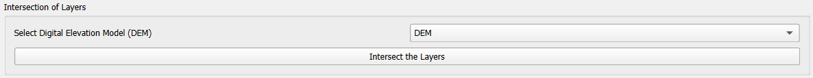
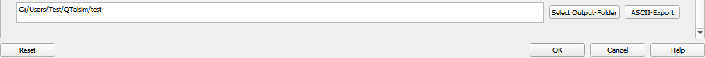
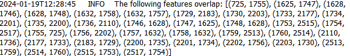
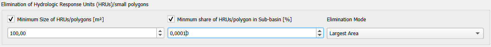
